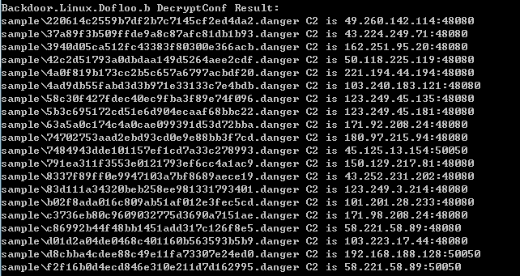

virusname: Backdoor.Linux.Dofloo.b(Kaspersky) Trojan:Win32/Skeeyah.A!bit(Microsoft)  Linux/MrBlack.G(AVG)

botsize: 1,870,048

Botnet controller default port: 48080、50050



```
DecryptConf Sample:
4ad9db55fabd3d3b971e33133c7e4bdb
d8cbba4cdee88c49e11fa73307e24ed0
83d111a34320beb258ee981331793401
b02f8ada016c809ab51af012e3fec5cd
f2f16b0d4ecd846e310e211d7d162995
c86992b44f48bb1451add317c126f8e5
5b3c695172cd51e6d904ecaaf68bbc22
42c2d51793a0dbdaa149d5264aee2cdf
d01d2a04de0468c401160b563593b5b9
7484943dde101157ef1cd7a33c278993
220614c2559b7df2b7c7145cf2ed4da2
58c30f427fdec40ec9fba3f89e74f096
c3736eb80c9609032775d3690a7151ae
63a5a0c174c4a0cae099391d53d72bba
4a0f819b173cc2b5c657a6797acbdf20
5452111fe611a3896b24dd7624a8ad14
37a89f3b509ffde9a8c87afc81db1b93
8337f89ff0e9947103a7bf8689aece19
791ea311f3553e0121793ef6cc4a1ac9
74702753aad2ebd93cd0e9e88bb3f7cd

```
