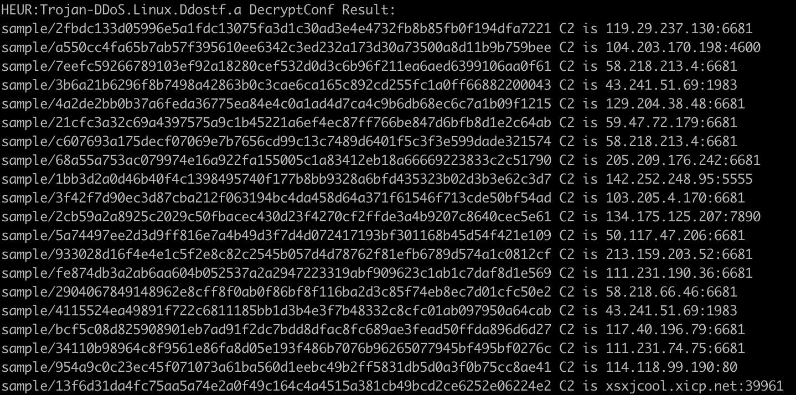

virusname: HEUR:Trojan-DDoS.Linux.Ddostf.a(Kaspersky) 

botsize: 1,058,408 / 649,585 / 649,609 / 1,048,576 /942,080

Botnet controller default port: None



```
DecryptConf Sample:

1bb3d2a0d46b40f4c1398495740f177b8bb9328a6bfd435323b02d3b3e62c3d7
2cb59a2a8925c2029c50fbacec430d23f4270cf2ffde3a4b9207c8640cec5e61
2fbdc133d05996e5a1fdc13075fa3d1c30ad3e4e4732fb8b85fb0f194dfa7221
3b6a21b6296f8b7498a42863b0c3cae6ca165c892cd255fc1a0ff66882200043
4a2de2bb0b37a6feda36775ea84e4c0a1ad4d7ca4c9b6db68ec6c7a1b09f1215
5a74497ee2d3d9ff816e7a4b49d3f7d4d072417193bf301168b45d54f421e109
7eefc59266789103ef92a18280cef532d0d3c6b96f211ea6aed6399106aa0f61
21cfc3a32c69a4397575a9c1b45221a6ef4ec87ff766be847d6bfb8d1e2c64ab
954a9c0c23ec45f071073a61ba560d1eebc49b2ff5831db5d0a3f0b75cc8ae41
34110b98964c8f9561e86fa8d05e193f486b7076b96265077945bf495bf0276c
933028d16f4e4e1c5f2e8c82c2545b057d4d78762f81efb6789d574a1c0812cf
4115524ea49891f722c6811185bb1d3b4e3f7b48332c8cfc01ab097950a64cab
a550cc4fa65b7ab57f395610ee6342c3ed232a173d30a73500a8d11b9b759bee
c607693a175decf07069e7b7656cd99c13c7489d6401f5c3f3e599dade321574
fe874db3a2ab6aa604b052537a2a2947223319abf909623c1ab1c7daf8d1e569
bcf5c08d825908901eb7ad91f2dc7bdd8dfac8fc689ae3fead50ffda896d6d27
13f6d31da4fc75aa5a74e2a0f49c164c4a4515a381cb49bcd2ce6252e06224e2
2904067849148962e8cff8f0ab0f86bf8f116ba2d3c85f74eb8ec7d01cfc50e2
3f42f7d90ec3d87cba212f063194bc4da458d64a371f61546f713cde50bf54ad
68a55a753ac079974e16a922fa155005c1a83412eb18a66669223833c2c51790

```


