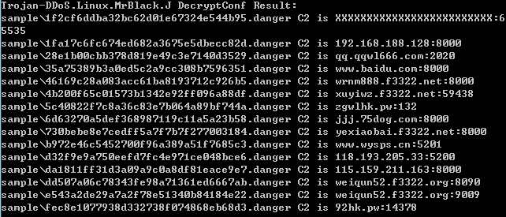

virusname: HEUR:Trojan-DDoS.Linux.Agent.f(Kaspersky) Linux/MrBlack.J(AVG) ELF:MrBlack-W\[Trj\](Avast)

botsize: 15,521

Botnet controller default port: None



```
DecryptConf Sample:

5c40822f7c8a36c83e7b064a89bf744a 
da1811ff31d3a09a9c0a8df81eace9e7
e543a2de29a7a2f78e51340b84184e22
1f2cf6ddba32bc62d01e67324e544b95 (conf error? decrypt error?)
dd507a06c78343fe98a71361ed6667ab
4b200f65c01573b1342e92ff096a88df
d32f9e9a750eefd7fc4e971ce048bce6
730bebe8e7cedff5a7f7b7f277003184
b972e46c5452700f96a389a51f7685c3
35a75389b3a0ed5c2a9cc308b7596351
1fa17c6fc674ed682a3675e5dbecc82d
6d63270a5def368987119c11a5a23b58
46169c28a083acc61ba8193712c926b5
fec8e1077938d332738f074868eb68d3
28e1b00cbb378d819e49c3e7140d3529

```
