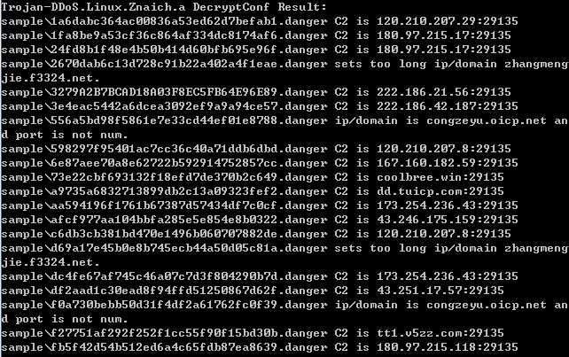

virusname: HEUR:Trojan-DDoS.Linux.Znaich.a(Kaspersky) DDoS:Linux/Zanich.B(Microsoft)

botsize: 1,584,675(x86)  1,820,918(x64)

Botnet controller default port: 29135



```
x86 DecryptConf Sample:

3279a2b7bcad18a03f8ec5fb64e96e89
afcf977aa104bbfa285e5e854e8b0322
2670dab6c13d728c91b22a402a4f1eae (Conf Error:sets too long ip/domain)
1fa8be9a53cf36c864af334dc8174af6
6e87aee70a8e62722b592914752857cc
aa594196f1761b67387d57434df7c0cf
3e4eac5442a6dcea3092ef9a9a94ce57
f0a730bebb50d31f4df2a61762fc0f39 (Conf Error:port is not num)
c6db3cb381bd470e1496b060707882de
1a6dabc364ac00836a53ed62d7befab1
```

```
x64 DecryptConf Sample:

df2aad1c30ead8f94ffd51250867d62f
73e22cbf693132f18efd7de370b2c649
f27751af292f252f1cc55f90f15bd30b
24fd8b1f48e4b50b414d60bfb695e96f
dc4fe67af745c46a07c7d3f804290b7d
d69a17e45b0e8b745ecb44a50d05c81a (Conf Error:sets too long ip/domain)
fb5f42d54b512ed6a4c65fdb87ea8639
556a5bd98f5861e7e33cd44ef01e8788 (Conf Error:port is not num)
598297f95401ac7cc36c40a71ddb6dbd
a9735a6832713899db2c13a09323fef2
```